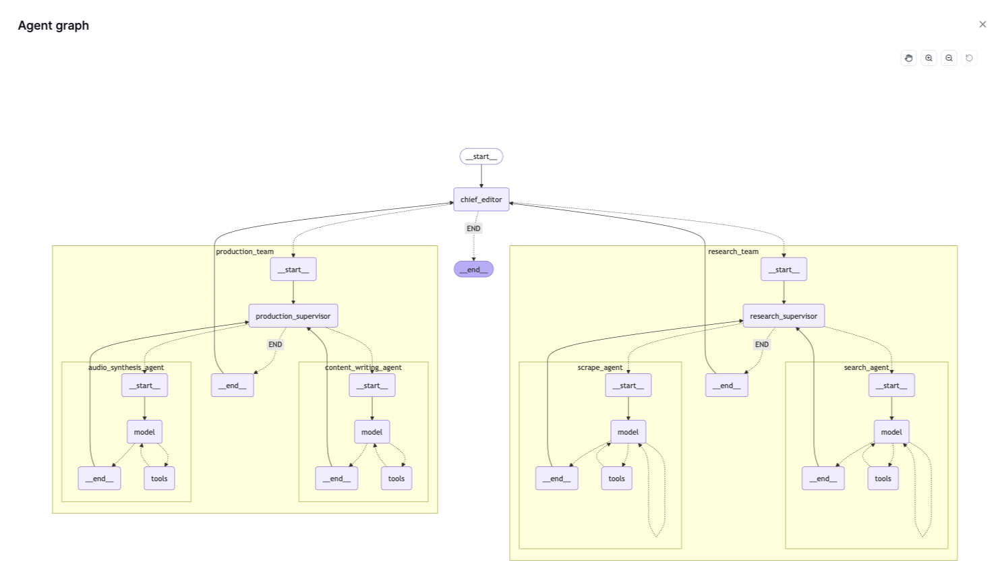
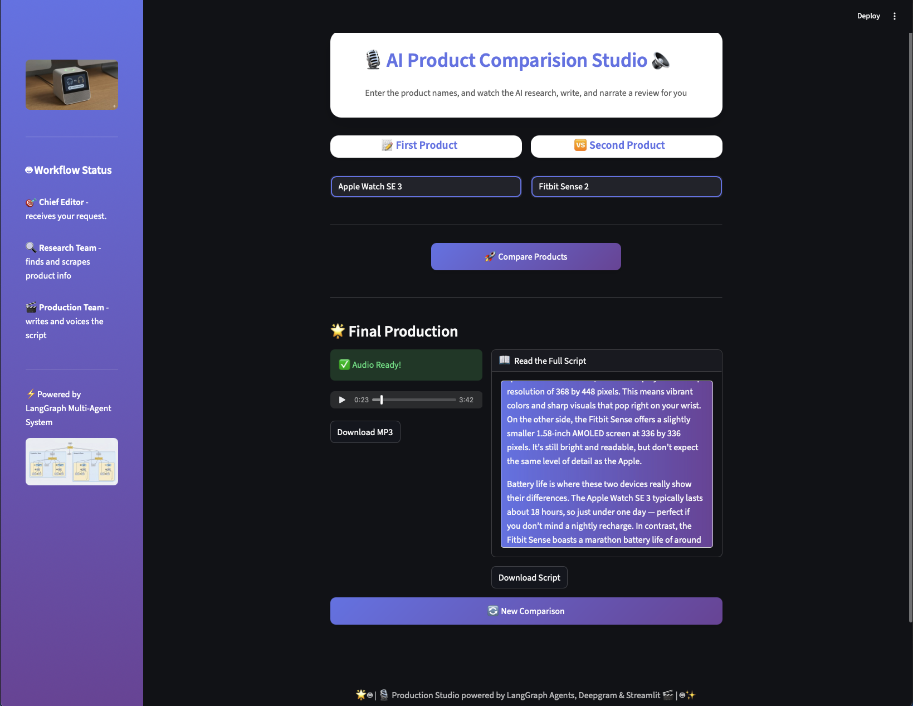

# LangGraph Examples


## Environment Setup

Use [UV environment manager](https://docs.astral.sh/uv/getting-started/installation/) to run the examples.

```bash
# Install uv on MacOS
brew install uv

# Install uv on Windows
curl -LsSf https://astral.sh/uv/install.sh | sh
```

```bash
# Clone the Git repository
git clone <this_repository_url>
```

```bash
# Sync the environment 
uv sync
```

## Configuration

Create a `.env` file in the root directory and add your GitHub inference credentials:

```bash
GITHUB_INFERENCE_ENDPOINT="<github_inference_endpoint>"
GITHUB_TOKEN="<github_token>"
LOG_LEVEL="<log_level>"
OPIK_API_KEY="<opik_api_key>" # Optional for observability
TAVILY_API_KEY="<tavily_api_key>"
DEEPGRAM_API_KEY="<deepgram_api_key>"
```
The examples are currently configured to use GitHub Models via AzureAIChatCompletionsModel.

If you wish to use a different provider (e.g., OpenAI, Azure OpenAI, or Anthropic), code changes are required.

Example:
1. Open src/graph_examples/doc_generator/doc_gen.py
2. Update the DocGen class initialization to use your preferred LangChain chat model.
3. Update the model parameters to match your provider's available models.

## Running the Examples
<table border="1">
    <tr>
        <!-- This cell spans 2 columns -->
        <td colspan="2" align="center"><strong><h2>LangGraph Examples</h2></strong></td>
    </tr>
    <tr>
        <td colspan="2" style="height: 15px"></td>
    </tr>
    <tr>
        <td colspan="2" align="center"> <b>AI Product Comparision Studio</b><br><small><i> Production Studio powered by LangGraph Agents, Tavily, DuckDuckGo & Deepgram </i></small></td>
    </tr>
        <td colspan="2" align="center"> 
            <a href="src/graph_examples/review_product/review_product_graph.png"> </a>   
            <a href="src/graph_examples/review_product/review_product_ui.png"> </a>
            <br>
            <small><i>Sample Output: <a href="src/graph_examples/review_product/media/apple_watch_se3_vs_fitbit_sense.mp3">apple_watch_se3_vs_fitbit_sense.mp3, <a href="src/graph_examples/review_product/media/apple_watch_se3_vs_fitbit_sense.txt">apple_watch_se3_vs_fitbit_sense.txt</a></i></small>
            <br>
            <i>From the repository root folder, execute: <code>uv run product_review</code></i>
        </td>
    <tr>
        <td colspan="2" style="height: 15px"></td>
    </tr>
    <tr>
        <td> <b>Document Generator</b></td>
        <td> <b>Search and Reranking Analysis </b><br> <small><i>reranking via FlashRank & ms-marco-MiniLM-L-12-v2 cross-encoder</i></small></td>
    </tr>
    <tr>
        <td>
            <a href="src/graph_examples/doc_generator/doc_gen_graph.png"> </a>   
            <a href="src/graph_examples/doc_generator/doc_gen_ui.png"> </a>
        </td>
        <td>    
            <a href="src/graph_examples/rag_search/rag_search_graph.png"> </a>   
            <a href="src/graph_examples/rag_search/rag_search_ui.png"> </a>
        </td>
    </tr>
    <tr>
        <td><i>From the repository root folder, execute: <code>uv run doc_gen</code></i></td>
        <td><i>From the repository root folder, execute: <code>uv run rag_search</code></i></td>
    </tr>
    <tr>
    <td colspan="2" style="height: 15px"></td>
    </tr>
</table>

## 💡 Heads Up
This is a living repository. Expect regular updates as the design matures, new workflows are added, and existing workflows are refined.