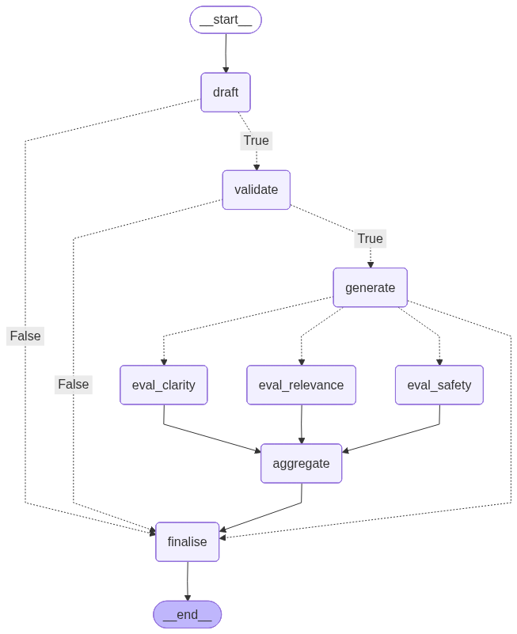
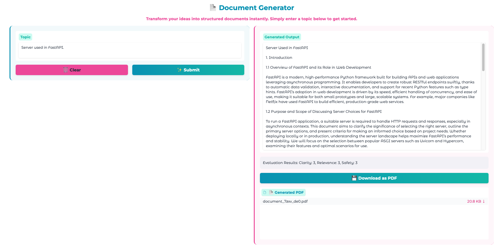

# LangGraph Examples


## Environment Setup

Use [UV environment manager](https://docs.astral.sh/uv/getting-started/installation/) to run the examples.

```bash
# Install uv on MacOS
brew install uv

# Install uv on Windows
curl -LsSf https://astral.sh/uv/install.sh | sh
```

```bash
# Git clone the repository
git clone https://github.com/RashmiJK/langgraph-examples.git
```

```bash
# Sync the environment 
uv sync
```

## Running the Examples
<table border="1">
    <tr>
        <!-- This cell spans 2 columns -->
        <td colspan="2" align="center"><strong><h2>LangGraph Examples</h2></strong></td>
    </tr>
    <tr>
        <td> Document Generator</td>
        <td> Next Example </td>
    </tr>
    <tr>
        <td>
            
            
        </td>
        <td>            
        </td>
    </tr>
    <tr>
        <td>Execute: <code>uv run doc_gen</code></td>
        <td></td>
    </tr>
</table>